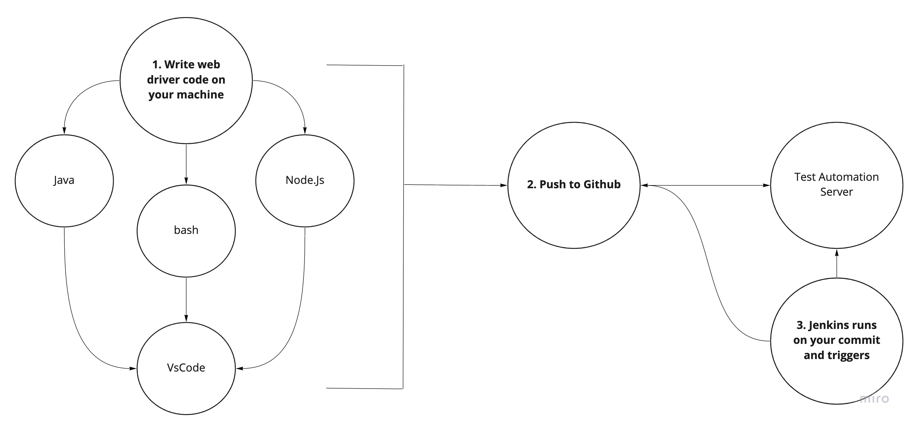

# Interview Question: Tell us about your Development environment

- Tell us about your dev environment
    - We used windows laptops and github for our repo. Our Jenkins server would then grab the files from the branch on commit and run the test. I used Visual Studio Code for my code editor and bash for my terminal. 

## The daily dev process



<br>

# Setting up your Windows machine


## 0. Setup Suggestions
- Laptop: At least 16GB of RAM. If you can get a Macbook Pro from eBay for an affordable price, do it. It's built on linux and its a great choice for Software Development.
- 2nd Monitor: I use a portable monitor from Amazon that uses USB power. Model number AOC e1659Fwu.
- Pen and paper: Physically take notes, pause and talk about it, draw out the functions, map out the connections, etc.

<br>

## 0.0 About executing commands

\<executable> \<command> [option]

Examples: 
``` bash
java -version # java is the executable, -version is the command, option is not needed
```
``` bash
npm install @wdio/cli # npm is the executable, install is the command, @wdio/cli is the option
```


## 1. Install Java

Needed by Webdriverio to run

- Go to https://www.oracle.com/technetwork/java/javase/downloads/index.html, click download for the latest download and choose the defaults
- Set the environment for Windows:
    - Go to C drive in the file explorer. Choose Program files, then Java, go into the current version folder, then choose bin and copy the path
    - Add on to the PATH: Follow the instructions for your OS https://www.java.com/en/download/help/path.xml, edit the PATH, go to the end, type a semi colon, then paste the path you copied earlier and save
- Open the terminal and type java -version. You should not get an error. If so, time to google. 

<br>


## 2. Install Git Bash

It is a terminal used on windows that allows you to use linux commands. It also installs git commands for github. 

- Go to https://gitforwindows.org/ and choose the defaults

<br>


## 3. Install Visual Studio Code

It is a code editor with a lot of good tools to make programming simpler.

- Go to https://code.visualstudio.com/download and choose the defaults
- open vscode, choose file and select "auto save"
- choose settings > preferences > search for "word wrap" > turn on
- choose view > command palette > search "default shell" > choose git bash
- On the far right, choose the icon with the 4 boxes > search for es6 mocha snippets and install > search for bracket pair colorizer and install

<br>

## 4. Install Node JS

It is a runtime environment, that allows you to use JavaScript on your computer, and not just in the browser.

- Go to https://nodejs.org/dist/latest-v10.x/, download the .msi for your computer and choose the defaults

<br>

## 5. Sign up for a Github account and clone the test framework to your computer

GitHub is like Dropbox for code. It is a repository for software projects. Some repos are public and some are private.

- Go to https://github.com/ and sign up for an account
- Go to our repo //NEED REPO URL// and choose fork at the top right, to copy the files to your github account
- In Git Bash, copy and paste the following (only the command before #):

```bash
git config --global user.name "Your first and last name here"
```

```bash
git config --global user.email "your_email@example.com"
```

```bash
ssh-keygen -t rsa -C "your_email@example.com" # press enter when asked to name the file
```

```bash
vi ~/.ssh/id_rsa.pub # copy the token > press esc > type:wq > click enter 
```
<br>

Go to account settings in github > click ssh keys > add ssh key > add a label


Test connection in Git Bash with:

```bash
ssh -T git@github.com # should return a message stating that it was successful
```

- In your forked repo, click the green button "Clone or download" > choose "Use SSH"  and copy the url 
- In git bash, copy and paste the following:

```bash
mkdir qaClass && cd qaClass
```

```bash
git clone <URL> # Example git clone git@github.com:chazhall54/hilton.git
```

<br>

# 6. Run a test
In your git bash do the following:

```bash
npm install
```
```bash
npm run test
```
